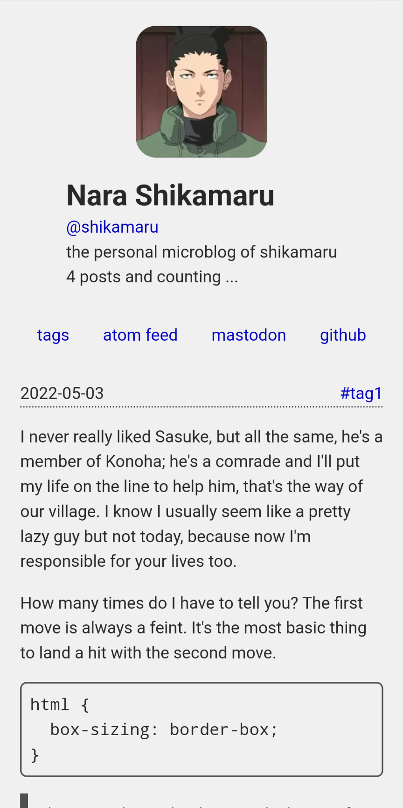

# kangae (考え, idea or thought)

[kangae][1] is a lightweight microblog theme for [zola][2].

<details>
  <summary>kangae screenshots on desktop and mobile</summary>

  
  
  
  
</details>

I've created kangae from scratch and it is not based on any other theme. However, I was inspired to
create kangae after I came across [Wolfgang Müller's microblog][3]. Thanks Wolf!

kangae is licensed under the [NCSA license][5], which is quite similar to the BSD-3-Clause license.
Unlike BSD-3-Clause, NCSA also covers documentation of a project.

# Installation

Before using this theme, [install zola][6]. After you've installed zola,

```
$ zola init microblog
> What is the URL of your site? (https://example.com):
> Do you want to enable Sass compilation? [Y/n]:
> Do you want to enable syntax highlighting? [y/N]:
> Do you want to build a search index of the content? [y/N]:
$ cd microblog/
```

kangae doesn't use Sass or syntax highlighting so if you don't want to use custom Sass code or
enable syntax highlighting, answer the 2nd and 3rd question with a 'no'. kangae also doesn't use any
JavaScript library to search content. If you don't intend to install a JavaScript library to enable
search on your microblog, answer 'no' to the last question as well.

If you intend to publish your microblog on a forge like GitHub, initialize an empty git repository
using

```
$ git init
$ git commit --allow-empty -m 'initial empty root commit'
```

If you don't want to make an empty commit, add and commit a README or a LICENSE file instead.

At this point, you can install kangae using one of the following methods

## using `git subtree`

```
$ git subtree add -P themes/kangae/ --squash https://github.com/ayushnix/kangae.git master
```

## using `git submodule`

```
$ git submodule add https://github.com/ayushnix/kangae.git themes/kangae
```

## download kangae in themes directory

If you want to keep things simple and figure out version control later, you can

```
$ git clone https://github.com/ayushnix/kangae.git themes/kangae
```

# Configuration

To begin using kangae after installing it,

```
$ cp themes/kangae/config.toml ./
$ sed -i 's;# theme =\(.*\);theme =\1;' config.toml
```

The [`config.toml`][7] file of kangae has been documented carefully using TOML comments. If you have
any questions about configuring kangae which haven't been answered in the `config.toml` file itself,
please [raise an issue][8].

## Optional Features

kangae includes some optional features that aren't enabled by default

- [style external links using a ↗ unicode symbol][11]

# Showcase

Here's a list of websites using the kangae theme

- [ayushnix microblog][4]

If you want to mention your website in this section, please raise a pull request.

# TODO (maybe?)

- (responsive) image shortcodes
- a11y shortcode for ASCII emoticons
- sample favicon, opengraph content, and web manifest
- run prettier on HTML and CSS before deployment
- pagination
- twitter and mastodon shortcodes
- add optional support for cross posting and commenting on mastodon without using JS
- add optional support for [giscus][9] and [loading mastodon comments][10]

[1]: https://kangae.ayushnix.com/
[2]: https://www.getzola.org/
[3]: https://zunzuncito.oriole.systems/
[4]: https://microblog.ayushnix.com
[5]: LICENSE
[6]: https://www.getzola.org/documentation/getting-started/installation/
[7]: config.toml
[8]: https://github.com/ayushnix/kangae/issues/new
[9]: https://giscus.app/
[10]: https://carlschwan.eu/2020/12/29/adding-comments-to-your-static-blog-with-mastodon/
[11]: https://github.com/ayushnix/kangae/blob/master/static/css/style-external-links.css
